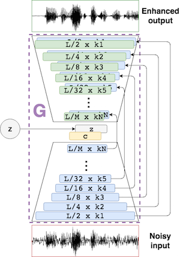
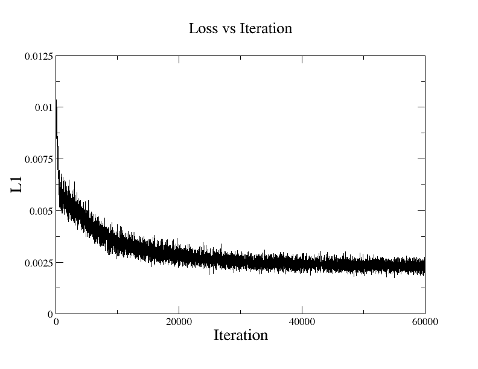

# Speech Enhancement Auto-Encoder

## Network Architecture:

The auto-encoder part borrowed from [SEGAN](https://arxiv.org/pdf/1703.09452.pdf)'s generator. 



## Results:
|                | PESQ          | SSNR     |
|---------------:|--------------:|---------:|
| Noisy          | 1.97          | 1.68     |
|  SEAE          | 2.2           | 7.6      |

Measurement implementation is included in Speech Enhancement: Theory and Practice. [Publisher website](https://www.crcpress.com/downloads/K14513/K14513_CD_Files.zip).


## Dependencies:
* Tensorflow 1.14

## Data:
* Please download the [Dataset (Valentini et al.2016)](https://drive.google.com/file/d/1NBIOCk1ouXqi_cY-XxH9_cDTftVYXYAR/view?usp=sharing).

* Unzip and move the directories into ```data```.

* Run ```python tfrecords.py```

Format : 16kHz sample rate, 16bit signed integer

## Usage:

### Train

```
./train.sh
```




Training results (trained model, log) are saved in ```results/```.

### Inference

```
./inference.sh
```

You can find the enhanced data in ```inferences```.
