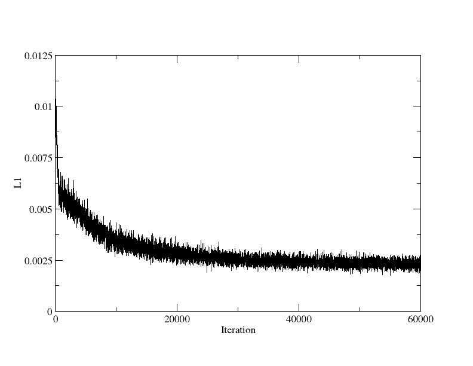

# Speech Enhancement Auto-Encoder

## Results:

| Pixel Accuracy | Mean Accuracy | Mean IoU |
| -------------- |:-------------:| --------:|
| 85.8%          | 58.1%         | 47.90%   |

|                | Mean Accuracy | Mean IoU | aaaa |
|----------------|---------------|----------|------|
| Noisy          | 58.1%         | 47.90%   |55.0% |
|  SEAE          |               |          |      |

|       | Pixel Accuracy | Mean Accuracy | Mean IoU |
|       | -------------- |:-------------:| --------:|
| Noisy |                |               |          |
| SEAE  | 85.8%          | 58.1%         | 47.90%   |

## Dependencies:
* Tensorflow 1.14

## Data:
Please download the [VCTK dataset](https://drive.google.com/file/d/1NBIOCk1ouXqi_cY-XxH9_cDTftVYXYAR/view?usp=sharing)
## Usage:

### Train

```
./train.sh
```
**L1 loss**

### Test

```
./inference.sh
```
